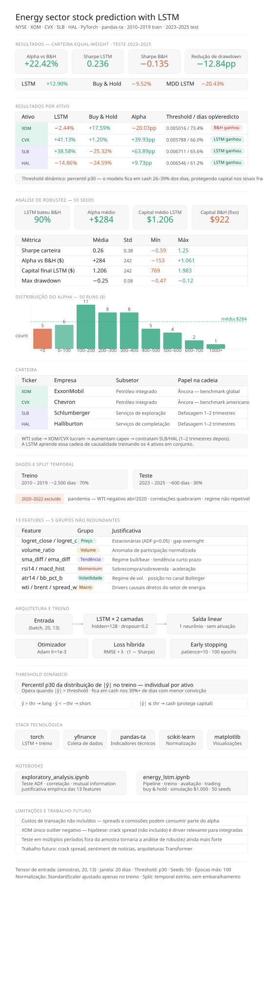

# Previsão de Ações do Setor de Energia com LSTM

> Modelo LSTM multivariado para previsão de retorno diário em uma carteira NYSE de energia — treinado com dados de 2010–2019, testado em 2023–2025 com comparação out-of-sample contra buy & hold e análise de robustez com 50 seeds.



---

## Resultados — Carteira Equal-Weight · Teste 2023–2025

| | LSTM | Buy & Hold |
|---|---|---|
| **Retorno** | +12,90% | −9,52% |
| **Sharpe ratio** | 0,236 | −0,135 |
| **Max drawdown** | −20,43% | −33,27% |
| **Alpha vs B&H** | **+22,42pp** | — |

### Por ativo

| Ticker | LSTM | B&H | Alpha | Veredicto |
|--------|------|-----|-------|-----------|
| XOM | −2,44% | +17,59% | −20,03pp | B&H ganhou |
| CVX | +41,13% | +1,20% | **+39,93pp** | LSTM ganhou ✓ |
| SLB | +38,58% | −25,32% | **+63,89pp** | LSTM ganhou ✓ |
| HAL | −14,86% | −24,59% | **+9,73pp** | LSTM ganhou ✓ |

> Threshold dinâmico no percentil p30 de |ŷ| — o modelo fica em cash 26–39% dos dias de negociação nos sinais de baixa convicção.

---

## Análise de Robustez — 50 Seeds

O pipeline completo foi retreinado 50 vezes com seeds diferentes para verificar que os resultados não são produto de uma inicialização de pesos sortuda.

| Métrica | Média | Std | Mín | Máx |
|---------|-------|-----|-----|-----|
| Sharpe (carteira) | 0,26 | 0,38 | −0,59 | 1,25 |
| Alpha vs B&H ($) | +284 | 242 | −153 | +1.061 |
| Capital final LSTM ($) | 1.206 | 242 | 769 | 1.983 |
| Max drawdown | −0,25 | 0,08 | −0,47 | −0,12 |

**O LSTM bateu o buy & hold em 45 dos 50 runs (90%).**

Capital B&H (fixo): $922 · Capital LSTM médio: $1.206

---

## Carteira

| Ticker | Empresa | Subsetor | Papel na cadeia |
|--------|---------|----------|-----------------|
| XOM | ExxonMobil | Petróleo integrado | Âncora — benchmark global |
| CVX | Chevron | Petróleo integrado | Âncora — benchmark americano |
| SLB | Schlumberger | Serviços de exploração | Defasagem 1–2 trimestres |
| HAL | Halliburton | Serviços de completação | Defasagem 1–2 trimestres |

**Lógica econômica:** WTI sobe → XOM/CVX lucram → aumentam capex → contratam SLB/HAL (1–2 trimestres depois). A LSTM multivariada aprende essa cadeia de causalidade treinando os 4 ativos em conjunto.

---

## Dados e Split

```
Treino   2010 – 2019   ~2.500 dias   (sem embaralhamento — split temporal estrito)
Teste    2023 – 2025   ~600  dias
```

> **2020–2022 excluído** — regime pandemia: WTI ficou negativo em abril de 2020, correlações históricas quebraram, quebra estrutural não repetível.

---

## Features — 13 entradas, 5 grupos não redundantes

| Feature | Grupo | Justificativa |
|---------|-------|---------------|
| `logret_close`, `logret_open` | Preço | Estacionárias (ADF p<0,05) · gap overnight |
| `volume_ratio` | Volume | Anomalia de participação normalizada |
| `sma_diff`, `ema_diff` | Tendência | Regime bull/bear · tendência curto prazo |
| `rsi14`, `macd_hist` | Momentum | Sobrecompra/sobrevenda · aceleração |
| `atr14`, `bb_pct_b` | Volatilidade | Regime de volatilidade · posição Bollinger |
| `wti_logret`, `brent_logret`, `spread_wb`, `ng_logret` | Macro | Drivers causais diretos do setor de energia |

Candidatas eliminadas por redundância (|r| > 0,90): `williams_r`, `stoch_k/d`, `CCI`, `ROC`, SMAs/EMAs brutas, `bb_width`, `vol_hist`. Justificativa completa com testes ADF, matrizes de correlação e Mutual Information em `exploratory_analysis.ipynb`.

---

## Arquitetura

```
Entrada (batch, 20, 13)  →  LSTM × 2 camadas (hidden=128, dropout=0.2)  →  Linear(128, 1)
```

**Sem ativação na saída** — log-returns são valores reais contínuos; sigmoid/tanh restringiriam o intervalo artificialmente.

**Loss híbrida:**
```
Loss = RMSE + λ · (1 − Sharpe normalizado)
```
RMSE puro minimiza erro de previsão mas pode gerar sinais de trading ruins. O termo Sharpe penaliza estratégias com baixo retorno ajustado ao risco. λ = 0,3.

| Componente | Valor |
|------------|-------|
| Janela de observação | 20 dias (1 mês de pregão) |
| Otimizador | Adam, lr = 1e-3 |
| Early stopping | patience = 10, máx 100 épocas |
| Normalização | StandardScaler — ajustado apenas no treino |

---

## Threshold Dinâmico

Cada ativo recebe seu próprio threshold = **percentil p30 de |ŷ| no conjunto de treino**.

```
|ŷ| > threshold  e  ŷ > 0  →  long  (compra)
|ŷ| > threshold  e  ŷ < 0  →  short (vende)
|ŷ| ≤ threshold              →  cash  (protege capital)
```

O percentil p30 foi selecionado por maximização do Sharpe na distribuição de treino. Isso mantém ~70% dos dias operando enquanto filtra os sinais de menor convicção.

---

## Stack

| Biblioteca | Uso |
|-----------|-----|
| `torch` | Definição e loop de treino da LSTM |
| `yfinance` | Coleta de dados históricos |
| `pandas-ta` | Indicadores técnicos (helper `get_col()` para nomes de colunas independente da versão) |
| `scikit-learn` | StandardScaler, métricas |
| `matplotlib` / `seaborn` | Visualizações |

```bash
pip install torch yfinance pandas-ta scikit-learn seaborn matplotlib
```

---

## Notebooks

| Arquivo | Conteúdo |
|---------|----------|
| `exploratory_analysis.ipynb` | Testes ADF · matrizes de correlação · Mutual Information · correlação cruzada entre ativos · justificativa empírica das 13 features |
| `energy_lstm.ipynb` | Pipeline completo: dados → features → treino → calibração de threshold → avaliação → estratégia de trading → comparação com buy & hold · simulação de $1.000 · análise de robustez com 50 seeds |

---

## Limitações

- **Custos de transação não incluídos** — bid-ask spread e comissões podem consumir parte do alpha em estratégias ativas.
- **XOM é o único ativo com alpha negativo** — hipótese: crack spread (não incluído como feature) é um driver relevante para integradas.
- **Período de teste coincide com recuperação pós-pandemia de SLB/HAL** — testar em múltiplos períodos fora da amostra fortaleceria ainda mais a análise de robustez.
- **Trabalho futuro:** adicionar crack spread, sentiment de notícias e testar arquiteturas Transformer.

---

## Referências

- Hochreiter, S. & Schmidhuber, J. (1997). *Long Short-Term Memory*. Neural Computation, 9(8), 1735–1780.
- Fischer, T. & Krauss, C. (2018). *Deep learning with long short-term memory networks for financial market predictions*. European Journal of Operational Research, 270(2), 654–669.
- Murphy, J. J. (1999). *Technical Analysis of the Financial Markets*. New York Institute of Finance.
